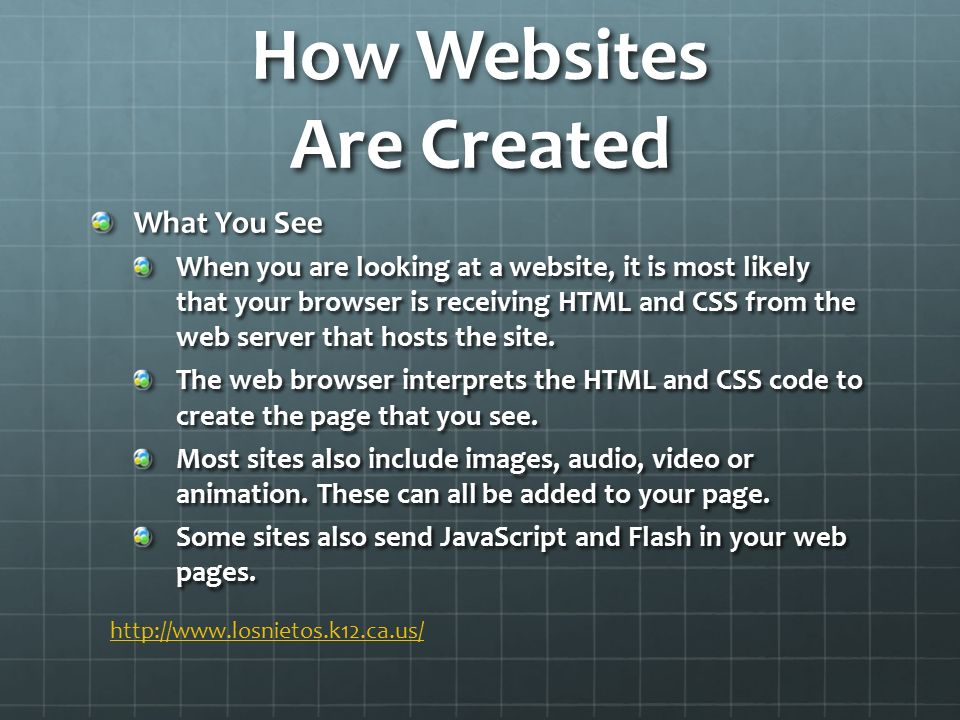
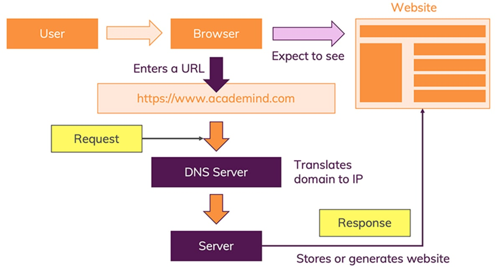
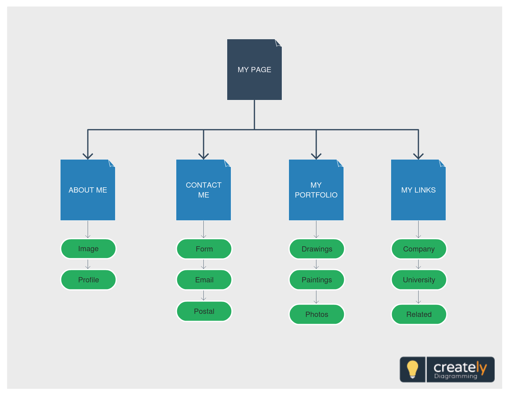
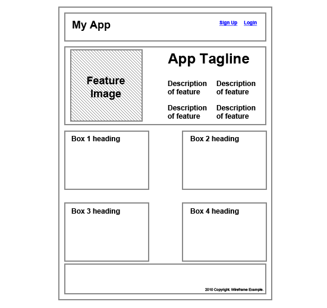

# How People Access The Web

* **Browsers** : Firefox, Internet Explorer, Safari,Chrome, and Opera.

* **Web Servers** : are special computers that are constantly connected to the Internet, and are optimized to send web pages out to people who request them

* **Devices** : desktop computers,laptops, tablets, and mobile phones

* **Screen readers** :  are programs that read out the contents of a computer screen to a user.

# How Websites Are Created :

 

# How the Web Works :

---
# HTML Uses Elements to Describe the Structure of Pages : 
    Each element has an opening tag and a closing tag.<opening>writing what i want</closing>

# Head , Body , Title

* **Head** : This contains information about the page, You will usually find a "<title element inside the <head element.

* **Body** : Everything inside this element is
shown inside the main browser window.

* **Title** : The contents of the <title element are either shown in the top of the browser, above where you usually type in the URL of the page you want to visit.

---

# Creating a Web Page on a PC : 

---

# The Evolution of HTML :

* **DOCTYPEs** : web page should begin with a
DOCTYPE declaration to tell a browser which version of HTML the page is using.

* **Comments in Html** : If you want to add a comment to your code that will not be
visible in the user's browser, you can add the text between these characters:

    

* **ID Attribute** : The id attribute is used to point to a specific style declaration in a style sheet.

* **Class Attribute** : The class attribute is mostly used to point to a class in a style sheet.

***The difference between an ID and a class is that an ID can be used to identify one element, whereas a class can be used to identify more than one***.

* **Block Elements** : always start on a new line and take up the full width available.

* **Inline Elements** : An inline element does not start on a new line,only takes up as much width as necessary.

---

# Grouping Text & Elements In a Block:

* **div tag** : The 
 element, and are typically used to specify character set, page description, keywords, author of the document, and viewport settings, There is a method to let web designers take control over the viewport.

* **Escape characters are used to include special characters in your pages such as <, >, and ©.**

---

* **the <header element used to contain the site
name and the main navigation.**

* **The <footer element contains copyright information, along with links to the privacy policy and terms and conditions.**

* **Navigation** : The <nav element is used to
contain the major navigational blocks on the site such as the primary site navigation.

* **Article** : The <article element acts as
a container for any section of a page that could stand alone and potentially be syndicated.

* **Aside** : The <aside tag defines some content aside from the content it is placed in.

* **Section** : The <section element groups related content together, and typically each section would have its own heading.

* **hgroup** : The purpose of the <hgroup element is to group together a set of one or more <h1 through <h6 elements so that they are
treated as one single heading.

* **Figure-Figurecaption** : Use a <figure element to mark up a photo in a document, and a <figcaption element to define a caption for the photo.

* **<a tag** : The <a tag defines a hyperlink, which is used to link from one page to another.

---

# Site map :

**allow you to plan the structure of a site.**

**The aim is to create a diagram of the pages that will be used to structure the site. This is
known as a site map and it will show how those pages can be grouped.**

# Wireframe : 

**allow you to organize the information that
will need to go on each page.**

**The wireframes make design easier because you know what information needs to appear on which page before considering how the the page should look.** 

---

**Visual hierarchy refers to the order in which your eyes perceive what they see. It is created by adding visual contrast between the items being
displayed. Items with higher contrast are recognized and processed first.**

---

# The ABC Of Programming 

---

**A script is a series of instructions that a
computer can follow to achieve a goal.**

**Computers approach tasks in a different way than
humans, so your instructions must let the computer
solve the task prggrammatically.**

# SKETCHING OUT THE TASKS IN A FLOWCHART :

**To approach writing a script, break down your goal into a series of tasks and then work out each step needed to complete that task**

---

# HOW A BROWSER SEES A WEB PAGE

1. **RECEIVE A PAGE AS HTML CODE**.

2. **CREATE A MODEL OF THE PAGE AND STORE IT IN MEMORY**

3. **USE A RENDERING ENGINE TO SHOW THE PAGE ON SCREEN**.

---

# HOW HTML, CSS, & JAVASCRIPT FIT TOGETHER 

* **Html**:  This is where the content of the page lives. The HTML gives the page structure and adds semantics.

* **CSS** : The CSS enhances the HTML page with rules that state how the HTML content is presented
(backgrounds, borders, box dimensions, colors, fonts).

* **JavaScript** : This is where we can change
how the page behaves, adding ***interactivity***.

---

# LINKING TO A JAVASCRIPT FILE FROM AN HTML PAGE :

