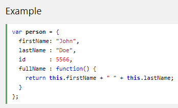

# Links 

**HTML links are hyperlinks,you can click on a link and jump to another document.**

## Syntax 

`<a href="url">link text</a>`

## The different between Relative Url & Absolute Url :
* **absolute URL :a full web address.**
* **relative URL :local link (a link to a page within the same website).**

## Image as a Link

## Link to an Email Address

**Use *mailto* inside the href attribute to create a link that opens the user's email program**

**Use the *target* attribute to define where to open the linked document.**

***The output of example in page 358***

# Functions

**is a block of code designed to perform a particular task,is executed when something invokes it (calls it).**

## Syntax

function name(parameter1, parameter2, parameter3) {

  // code to be executed

}

**Function *parameters* are listed inside the parentheses ( ) in the function definition**

**Function *arguments* are the values received by the function when it is invoked.**

# Object Methods

**An object is a series of variables and functions that represent something from the world around you.**

**In an object, variables are known as properties of the object; functions are known as *methods* of the object**

# How does pair programming work?

**is an agile software development technique in which two programmers work together at one workstation. One, the driver, writes code while the other, the observer or navigator, reviews each line of code as it is typed in. The two programmers switch roles frequently.**

## Why pair program?

* **Greater efficiency**.
* **Engaged collaboration**.
* **Learning from fellow students**.
* **Social skills**.
* **Job interview readiness**.
* **Work environment readiness**.

