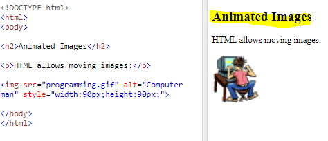
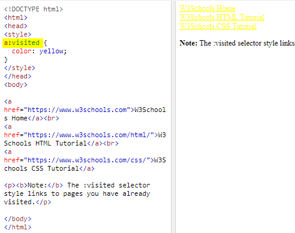

# Images

**Images can improve the design and the appearance of a web page.**

## HTML Images Syntax

``

**The  tag has two required attributes:**

* **src**: Specifies the path to the image.
* **alt**: Specifies an alternate text for the image.

**If a browser cannot find an image, it will display the value of the alt attribute**

**Image Size - Width and Height**

**We can change yhe width ang height of image.**

**Images on Another Website.**

***Just put in src the addreess of image.***

**Animated Images**

HTML allows animated GIFs:

**Float image**

---

# CSS

## What is CSS :

CSS stands for **Cascading Style Sheets**.

CSS describes how HTML elements are to be displayed on screen, paper, or in other media.

---

## CSS Syntax :

---

## CSS Colors :

Colors are specified using predefined **color names, or RGB, HEX, HSL** .

* rgb(red, green, blue)
    * rgba(red, green, blue, alpha)

**The alpha parameter is a number between 0.0 (fully transparent) and 1.0 (not transparent at all)**

* HEX : #rrggbb

* HSL : hsl(hue, saturation, lightness)
    * hsla(hue, saturation, lightness, alpha)

## CSS Background Color:

**Name Of Color**

<h1 style="background-color:red;">Saja</h1>

---
**HEX**

<h1 style="background-color:#ff6347;">Saja </h1>

---

**RGB**

<h1 style="background-color:rgba(255, 99, 71, 0.5);">Saja<h1>

---

**HLS**

<h1 style="background-color:hsl(0, 100%, 75%);">Saja<h1>

---

## CSS Text Color :

<h1 style="color:Gray;">LTUC</h1>

<h1 style="color:pink;">LTUC</h1>

<h1 style="color:Orange;">LTUC</h1>

---

## CSS Border Color :

<h1 style="border:4px solid yellow;">Saja</h1>

<h1 style="border:4px solid purple;">Saja</h1>

<h1 style="border:4px double red;">Saja</h1>

---

# Text

## Font family

## Font size

The font-size property sets the size of a font.

## Font-face

**@font-face allows you to use
a font, even if it is not installed
on the computer of the person
browsing, by allowing you to
specify a path to a copy of the
font.**

## Font Style

The font-style property specifies the font style for a text.

## Font transform

## Text-decoration

## Text-align

The text-align property specifies the horizontal alignment of text in an element.

## Vertical-align

## Text shadow

## Visited selector

The :visited selector is used to select visited links.

**You can use pseudo-classes to change the style of an element when a user hovers over or clicks on text, or
when they have visited a link.**

***:hover, :active, :focus***.

