# Object Literals:

**Object:  An object is a collection of properties, and a property is an association between a name (or key) and a value**.

**Is the easiest and most popular way to create object.**

* Example of literal object :

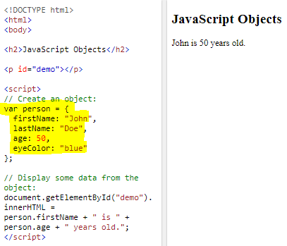

* The this Keyword In a function definition, this refers to the "owner" of the function.

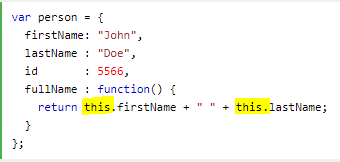

# The HTML DOM (Document Object Model)

**The HTML DOM model is constructed as a tree of Objects, allows programs and scripts to dynamically access and update the content, structure, and style of a document.**.

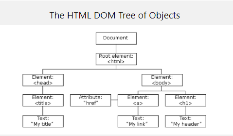

**DOM trees have four types of nodes: document nodes, element nodes, attribute nodes, and text nodes**

## Caching Dom Queris

**Methods that find elements in the DOM tree**.

## The getElementById Method:

The most common way to access an HTML element is to use the id of the element.

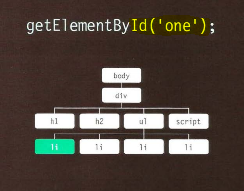

## ACCESSING ELEMENTS:

### Finding HTML Elements:

* Finding HTML elements by id.
* Finding HTML elements by tag name.
* Finding HTML elements by class name.
* Finding HTML elements by CSS selectors.
* Finding HTML elements by HTML object collections.

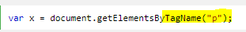

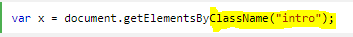

## The HTML DOM NodeList Object

A NodeList object is a list (collection) of nodes extracted from a document.

**NODELISTS**: DOM QUERIES THAT RETURN MORE THAN ONE ELEMENT.

**Whenever a DOM query can return more than one node, it will always return a Nadelist.**

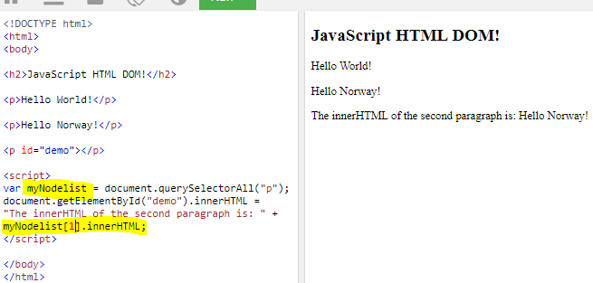

## Node Relationships

* In a node tree, the top node is called the root (or root node).
* Every node has exactly one parent, except the root (which has no parent).
* A node can have a number of children.
* Siblings (brothers or sisters) are nodes with the same parent.
### FlRST & LAST CHILD 

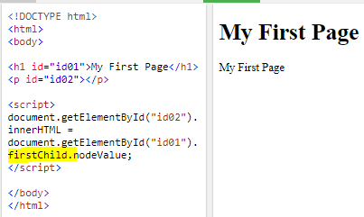

### The innerHTML Property

**The innerHTML property can be used to get or change any HTML element, including <html> and <body>**.

**From an element node, you can access and update its content using properties such as textContent and
innerHTML or using DOM manipulation techniques.**

### Changing HTML Elements

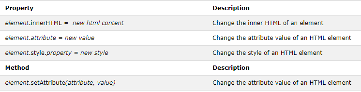

### Adding and Deleting Elements

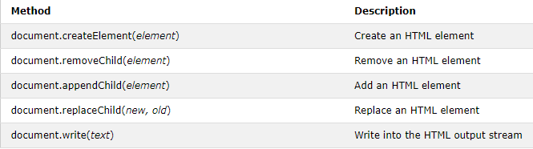

### The XML DOM

**is a standard for how to get, change, add, or delete XML elements.**

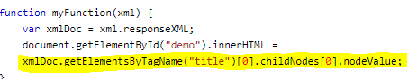

* xmlDoc - the XML DOM object created by the parser.

* getElementsByTagName("title")[0] - get the first <title element.

* childNodes[0] - the first child of the <title  element (the text node).

* nodeValue - the value of the node (the text itself).

