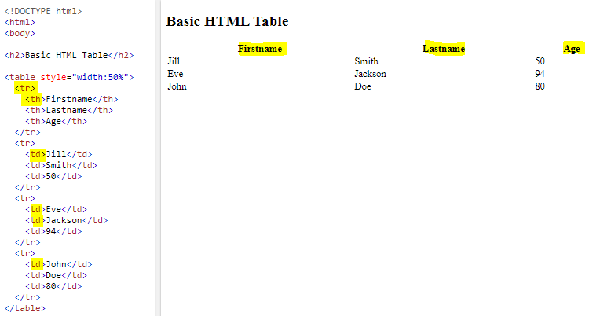
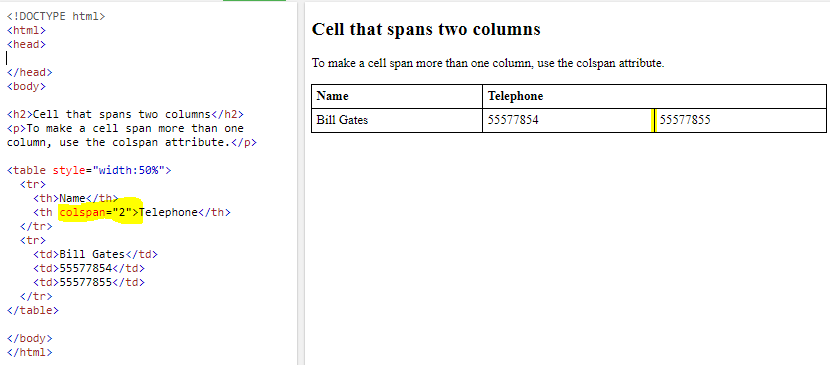
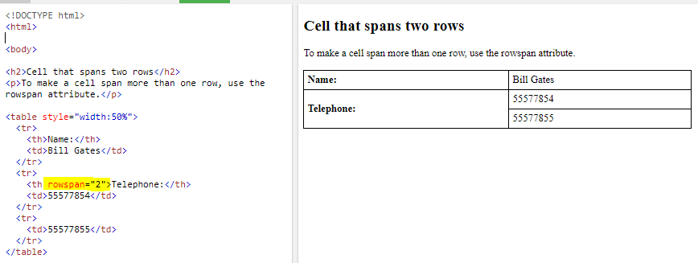
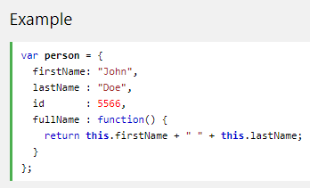
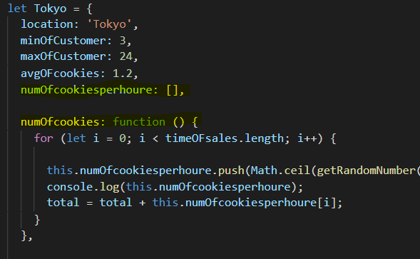
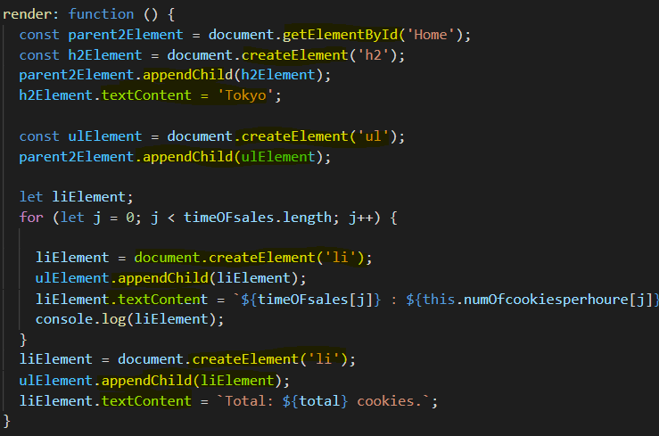

## Tables

A table represents information in a grid format. 

## Basic Table Structure

* The <table tag defines an HTML table.

* Each table row is defined with a <tr tag.

* Each table header is defined with a <th tag.

* Each table data is defined with a <td tag.

### HTML Table - Cell that Spans Many Columns

To make a cell span more than one column, use the colspan attribute.

### HTML Table - Cell that Spans Many Rows

To make a cell span more than one row, use the rowspan attribute.

**For long tables you can split the table into a <thead, <tbody, and <tfoot.**

# Functions

**is a block of code designed to perform a particular task,is executed when something invokes it (calls it).**

## Syntax

function name(parameter1, parameter2, parameter3) {

  // code to be executed

}

**Function *parameters* are listed inside the parentheses ( ) in the function definition**

**Function *arguments* are the values received by the function when it is invoked.**

# Object Methods

**An object is a series of variables and functions that represent something from the world around you.**

**In an object, variables are known as properties of the object; functions are known as *methods* of the object**

**When used any key in object used ***this*** to change or update value.**

**Can use in same object string, integer,boolean, array and function.**

# DOM : 

**By DOM can create element, change value,remove value and add value**.

1. get parent element.
2. create child.
3. append child to parent .
4. text content.

