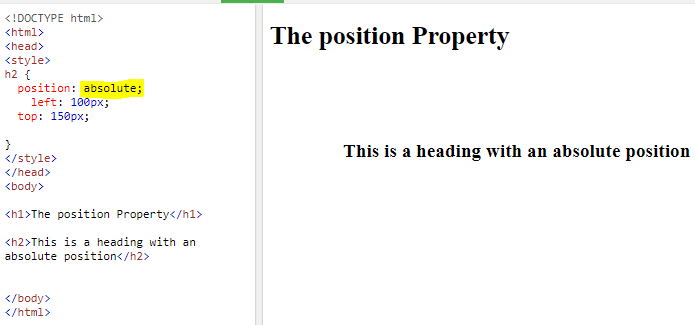
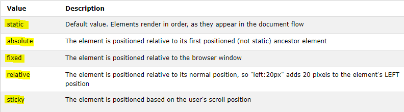
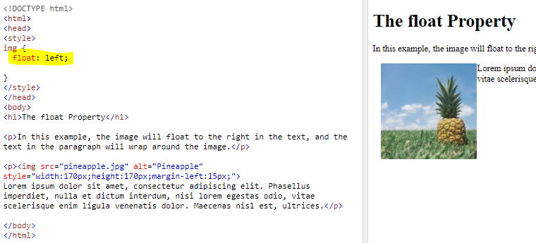
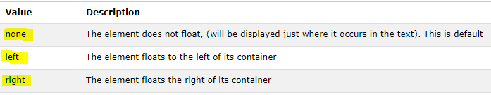
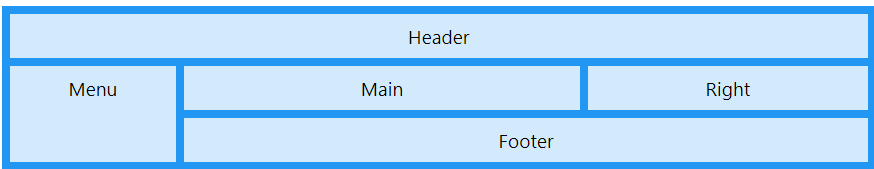
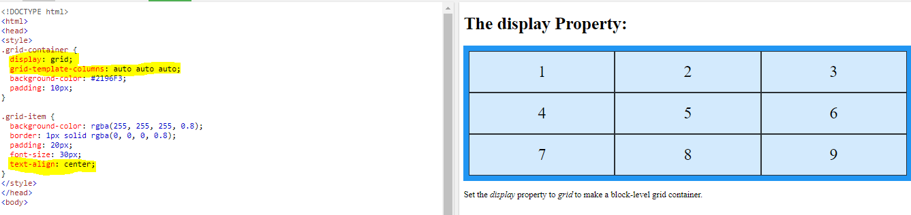

# Layout

## Controlling the position of elements:

The position property specifies the type of positioning method used for an element (static, relative, absolute, fixed, or sticky).

More position and description:

## Floating Elements

The float property specifies how an element should float.

## Layout Grids

The CSS Grid Layout Module offers a grid-based layout system, with rows and columns, making it easier to design web pages without having to use floats and positioning.

Example OF Layout Grid:

Grids help create professional and flexible designs.

CSS Frameworks provide rules for common tasks.

