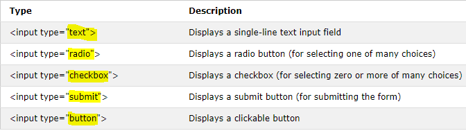
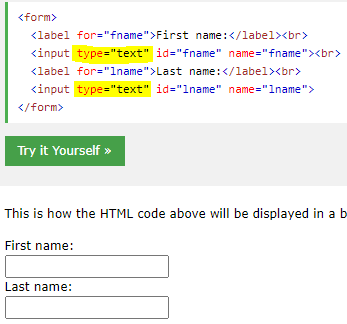
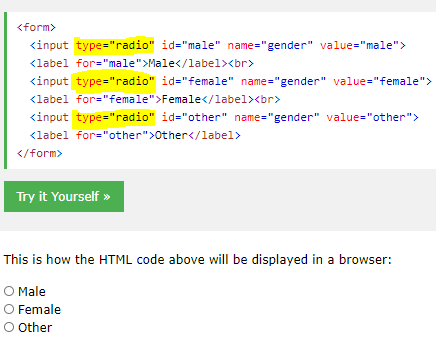
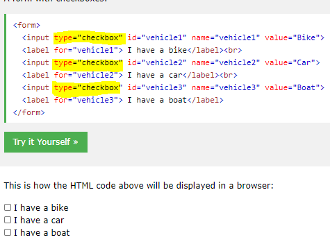
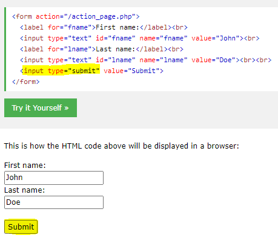
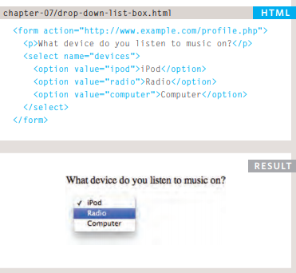
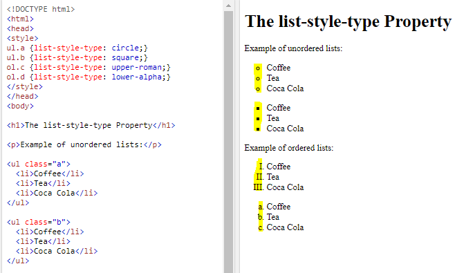
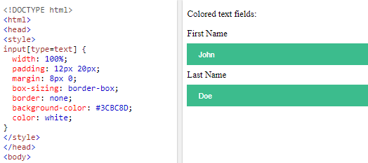
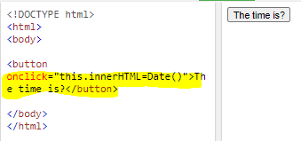
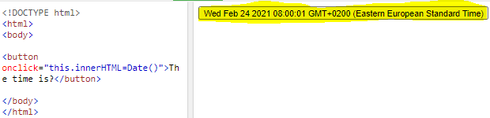

# Forms

An HTML form is used to collect user input. The user input is most often sent to a server for processing.

The <form element is a container for different types of input elements, such as: text fields, checkboxes, radio buttons, submit buttons.

The <input Element ,depending on the type attribute.

## Text Fields

* The <label tag defines a label for many form elements.

## Radio Buttons

## Checkboxes

Checkboxes let a user select ZERO or MORE options of a limited number of choices.

## The Submit Button

## Drop Down List Box

## List-style-type

* Unorder list 

* Order list 

## Styling Forms

# Events

An HTML event can be something the browser does, or something a user does, JavaScript lets you execute code when events are detected.

HTML allows event handler attributes, with JavaScript code, to be added to HTML elements: 

`<element event='some JavaScript'>`

when press on the button it make action.

Events are the browser's way of indicating when something has happened (such as when a page has finished loading or a button has been clicked).

When an event occurs on an element, it can trigger a JavaScript function. When this function then changes the web page in some way, it feels interactive because
it has responded to the user. 

