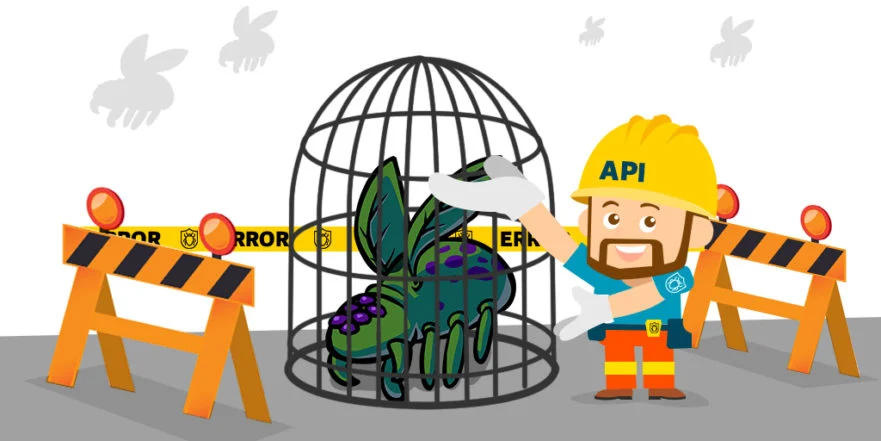

# Error handling debugging

Programming code might contain syntax errors, or logical errors, many of these errors are difficult to diagnose,often, when programming code contains errors, nothing will happen. There are no error messages, and you will get no indications where to search for errors.Searching for (and fixing) errors in programming code is called code **debugging.**

**all modern browsers have a built-in JavaScript debugger.**

# The console.log() Method

can write console.log in any place in code to review some errors or to detect errors.

open live server then right click go to inspect then console.

## Setting Breakpoints

you can set breakpoints in the JavaScript code,at each breakpoint, JavaScript will stop executing, and let you examine JavaScript values.

## The debugger Keyword

The debugger keyword stops the execution of JavaScript, and calls the debugging function,this has the same function as setting a breakpoint in the debugger.

If you know that you may get an error, you can handle it gracefully using the **try, catch, finally** statements. 

