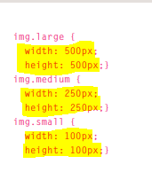
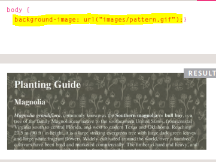
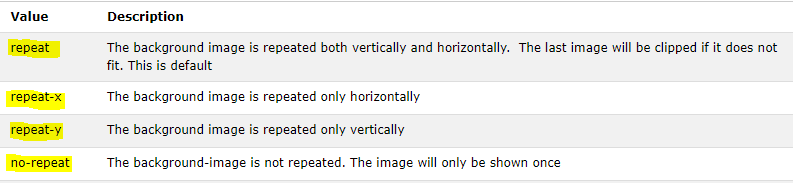
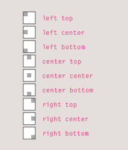
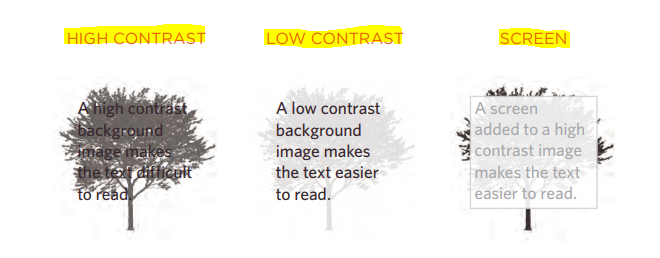
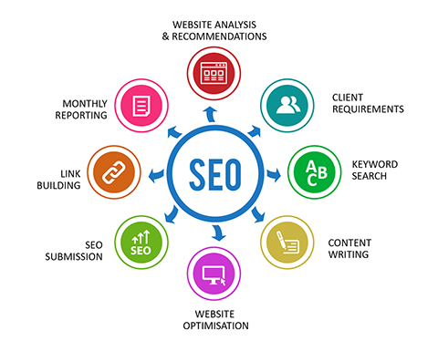
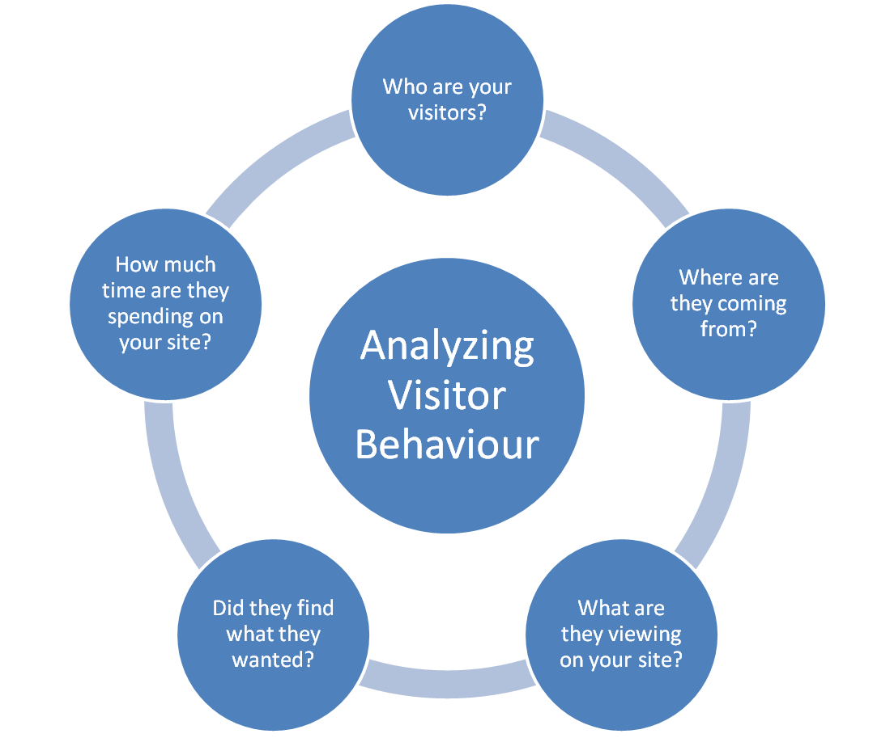

# Image

## Image size:

Can change size of image by css by :

* width.

* height.

## Align-image

By float left or right .

## Centering-image

By **display: block**, and **margin: 0px auto.**

## Background-image

Can put background by image by :

## Repeating-image

## Position-image

## Contrast of background images

If you want to overlay text on a background image, the image must be low
contrast in order for the text to be legible.

##  Search Engine Optimization

 it means the process of improving your site to increase its visibility for relevant searches. The better visibility your pages have in search results, the more likely you are to garner attention and attract prospective and existing customers to your business.

 

Analytics tools such as Google Analytics allow you to see how many people visit your site, how they find it, and what they do when they get there.

To put your site on the web, you will need to obtain a **domain name and web hosting.**

**FTP programs** allow you to transfer files from your local computer to your web server.

