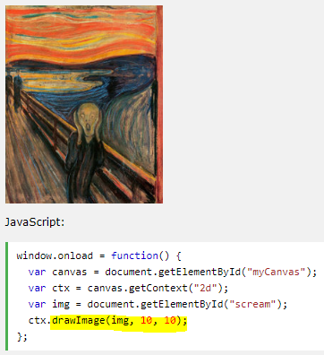

## What is HTML Canvas?

element is used to draw graphics, on the fly, via scripting (usually JavaScript).

Canvas has several methods for drawing paths, boxes, circles, text, and adding images.

The <canvas element must have an id attribute so it can be referred to by JavaScript.

The width and height attribute is necessary to define the size of the canvas.

## HTML Canvas Drawing

*  Find the Canvas Element

* Create a Drawing Object

* Draw on the Canvas

## HTML Canvas Coordinates

The HTML canvas is a two-dimensional grid, The upper-left corner of the canvas has the coordinates (0,0).

### Draw a Line

To draw a straight line on a canvas, use the following methods:

* moveTo(x,y) - defines the starting point of the line.
* lineTo(x,y) - defines the ending point of the line.

To actually draw the line, you must use one of the "ink" methods, like stroke().

### Draw a Circle

* beginPath() - begins a path .

* arc(x,y,r,startangle,endangle) - creates an arc/curve. To create a circle with arc(): Set start angle to 0 and end angle to 2*Math.PI. The x and y parameters define the x- and y-coordinates of the center of the circle. The r parameter defines the radius of the circle.

### HTML Canvas Gradients

Gradients can be used to fill rectangles, circles, lines, text, etc. Shapes on the canvas are not limited to solid colors.

There are two different types of gradients:

* createLinearGradient(x,y,x1,y1) - creates a linear gradient.

* createRadialGradient(x,y,r,x1,y1,r1) - creates a radial/circular gradient.

The **addColorStop()** method specifies the color stops, and its position along the gradient. Gradient positions can be anywhere between 0 to 1.

### Using createLinearGradient()

Create a linear gradient.

### Using createRadialGradient():

Create a radial/circular gradient.

### HTML Canvas Text

### Using fillText()

Set font to 30px "Arial" and write a filled text on the canvas.

### Using strokeText()

Set font to 30px "Arial" and write a text, with no fill, on the canvas:

### HTML Canvas Images

To draw an image on a canvas, use the following method:

* drawImage(image,x,y)

