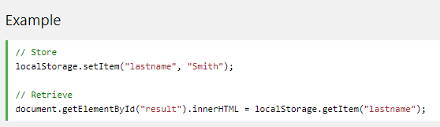
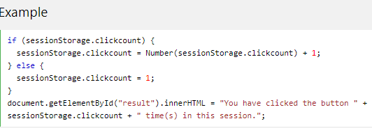
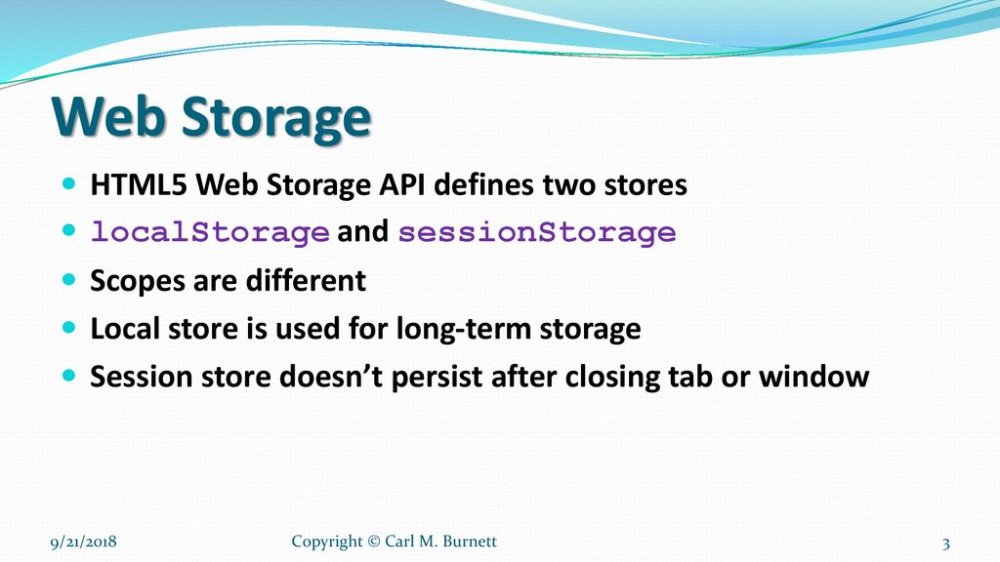

## HTML Web Storage API

With web storage, web applications can store data locally within the user's browser, Web storage is more secure, and large amounts of data can be stored locally, without affecting website performance.

### HTML Web Storage Objects

HTML web storage provides two objects for storing data on the client:

* window.localStorage - stores data with no expiration date.

* window.sessionStorage - stores data for one session (data is lost when the browser tab is closed).

Example explained:

* Create a localStorage name/value pair with name="lastname" and value="Smith".

* Retrieve the value of "lastname" and insert it into the element with id="result".

### The sessionStorage Object

The sessionStorage object is equal to the localStorage object, except that it stores the data for only one session. The data is deleted when the user closes the specific browser tab.

