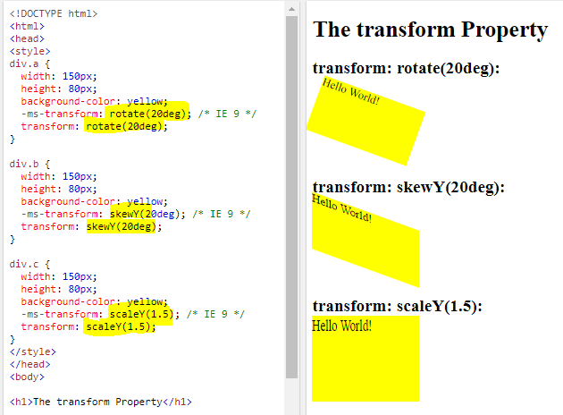
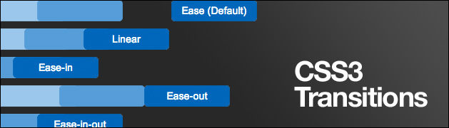
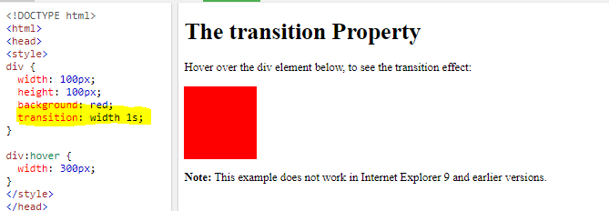
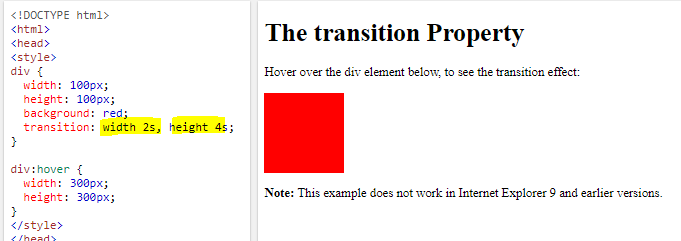
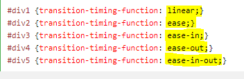
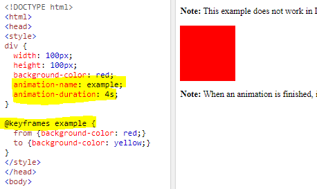

## CSS transform Property

The transform property applies a 2D or 3D transformation to an element. This property allows you to rotate, scale, move, skew elements.

## CSS Transitions

allows you to change property values smoothly, over a given duration.

To create a transition effect, you must specify two things:

* The CSS property you want to add an effect to.
* The duration of the effect.

Can change width and height.

The following example shows the some of the different speed curves that can be used:

## CSS Animations

An animation lets an element gradually change from one style to another.

### The @keyframes Rule

When you specify CSS styles inside the @keyframes rule, the animation will gradually change from the current style to the new style at certain times.

The **animation-duration** property defines how long time an animation should take to complete.

The **animation-delay** property specifies a delay for the start of an animation.

The **animation-iteration-count** property specifies the number of times an animation should run.

