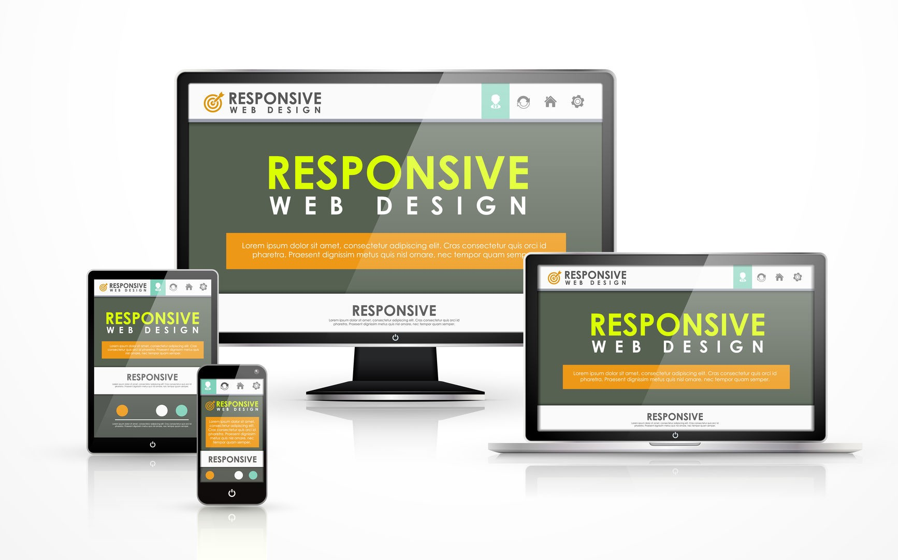
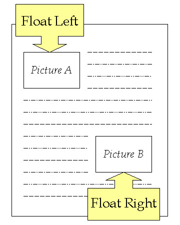

# Responsive Web Design

**Responsive web design** is about creating web pages that look good on all devices!

**Responsive web design** will automatically adjust for different screen sizes and viewports.

### Setting The Viewport

To create a responsive website, add the **meta** tag to all your web pages, will give the browser instructions on how to control the pages dimensions and scaling.

## Responsive Images

Responsive images are images that scale nicely to fit any browser size.

**Using the max-width Property**

If the max-width property is set to 100%, the image will scale down if it has to, but never scale up to be larger than its original size.

## Responsive Text Size

The text size can be set with a "vw" unit, which means the "viewport width".

**1vw = 1% of viewport width.**

## Media Queries

With media queries you can define completely different styles for different browser sizes.

---

# Float

Is a CSS positioning property.

### Setting the float on an element with CSS happens like this:

### Clearing the Float

The footer then is required to jump up into that available space as is required by the float. To fix this problem, the footer can be cleared to ensure it stays beneath both floated columns.

This the result when using the **Clear**.

---

