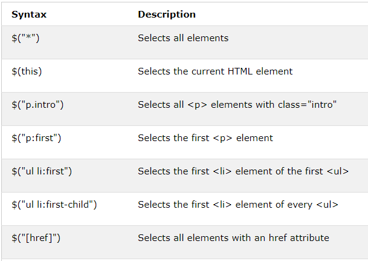

# What is jQuery?

jQuery takes a lot of common tasks that require many lines of JavaScript code to accomplish, and wraps them into methods that you can call with a single line of code.

jQuery is a **JavaScript library**.

## jQuery Syntax:

**$(selector).action()**.

## Examples of jQuery Selectors : 

## The element Selector:

* The #id Selector:

**$("#test")**

* The .class Selector:

**$(".test")**

## jQuery Event Methods:

An event represents the precise moment when something happens.

jQuery Syntax For Event Methods:

like this : **$("p").click();**

**.click() is an event**

* $(document).ready()

**The $(document).ready() method allows us to execute a function when the document is fully loaded.**

## jQuery - Add Elements:

* **append()** - Inserts content at the end of the selected elements.
* **prepend()** - Inserts content at the beginning of the selected elements.
* **after()** - Inserts content after the selected elements.
* **before()** - Inserts content before the selected elements.

---
# How does pair programming work?

**is an agile software development technique in which two programmers work together at one workstation. One, the driver, writes code while the other, the observer or navigator, reviews each line of code as it is typed in. The two programmers switch roles frequently.**

## Why pair program?

* **Greater efficiency**.
* **Engaged collaboration**.
* **Learning from fellow students**.
* **Social skills**.
* **Job interview readiness**.
* **Work environment readiness**.

