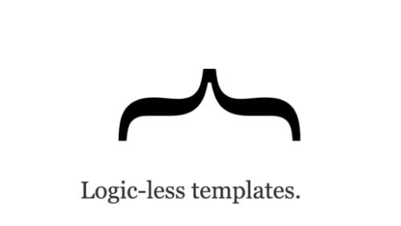

## Javascript Templating

Javascript templating is a fast and efficient technique to render client-side view templates with Javascript by using a JSON data source.

Mustache is a logic-less template syntax. It can be used for HTML, config files, source code . It works by expanding tags in a template using values provided in a hash or object.

### Configure mustache-express in your server.js/app.js/index.js file:

## Flex 

The flex property sets the flexible length on flexible items.

### CSS Syntax:

flex: flex-grow or flex-shrink or flex-basis;

### Flex-direction 

.container {

  flex-direction: row | row-reverse | column | column-reverse;

}

* row (default): left to right in ltr; right to left in rtl.
* row-reverse: right to left in ltr; left to right in rtl.
* column: same as row but top to bottom.
* column-reverse: same as row-reverse but bottom to top.

### Flex wrap 

### Justify-content 

### Align-item 

### Align-content 

