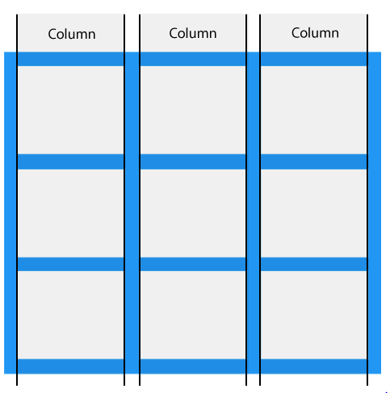
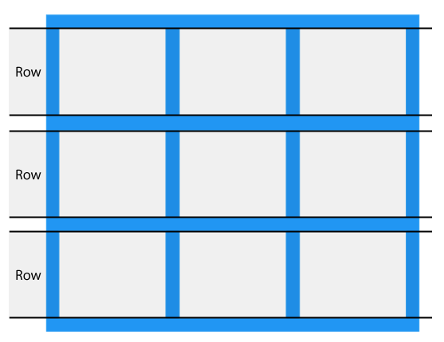
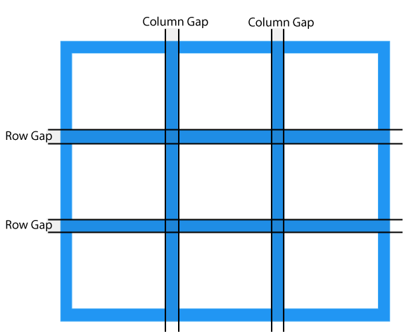

## Grid Layout

The CSS Grid Layout Module offers a grid-based layout system, with rows and columns, making it easier to design web pages without having to use floats and positioning.

### Grid Columns 

The vertical lines of grid items are called columns.

### Grid Rows

The horizontal lines of grid items are called rows.

### Grid Gaps

The spaces between each column/row are called gaps.

### Grid Lines
The lines between columns are called column lines.

The lines between rows are called row lines.

### The grid-template-columns Property

The grid-template-columns property defines the number of columns in your grid layout, and it can define the **width** of each column.

### The grid-template-rows Property

The grid-template-rows property defines the **height** of each row.