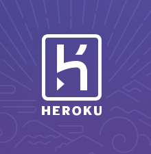

## What is Heroku?

Heroku is a container-based cloud Platform as a Service (PaaS). Developers use Heroku to deploy, manage, and scale modern apps. Our platform is elegant, flexible, and easy to use, offering developers the simplest path to getting their apps to market.

## Why work on Heroku?

* Our culture is collaborative, flexible, and fun.
* Our work provides opportunities for challenge and growth.
* Our team contributes expertise to a wide variety of open-source projects.
* Our company invests in our professional and personal well-being.
* Our products are simply the best in their class.

